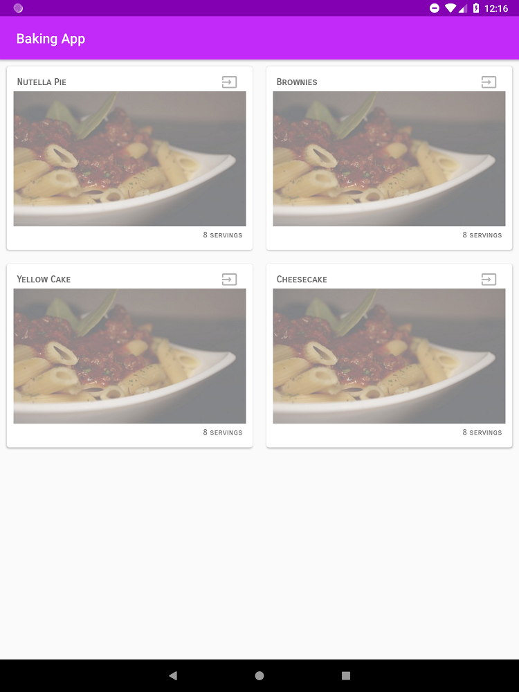
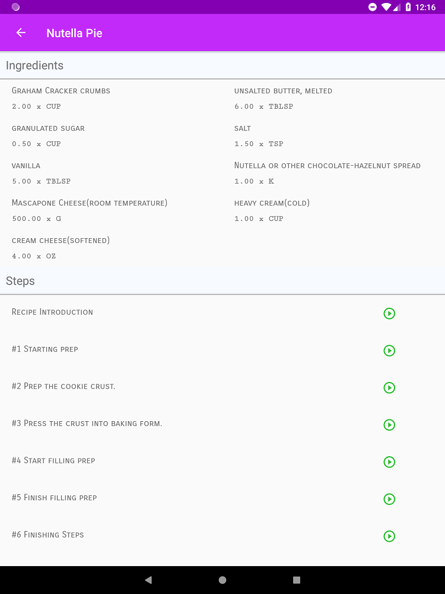
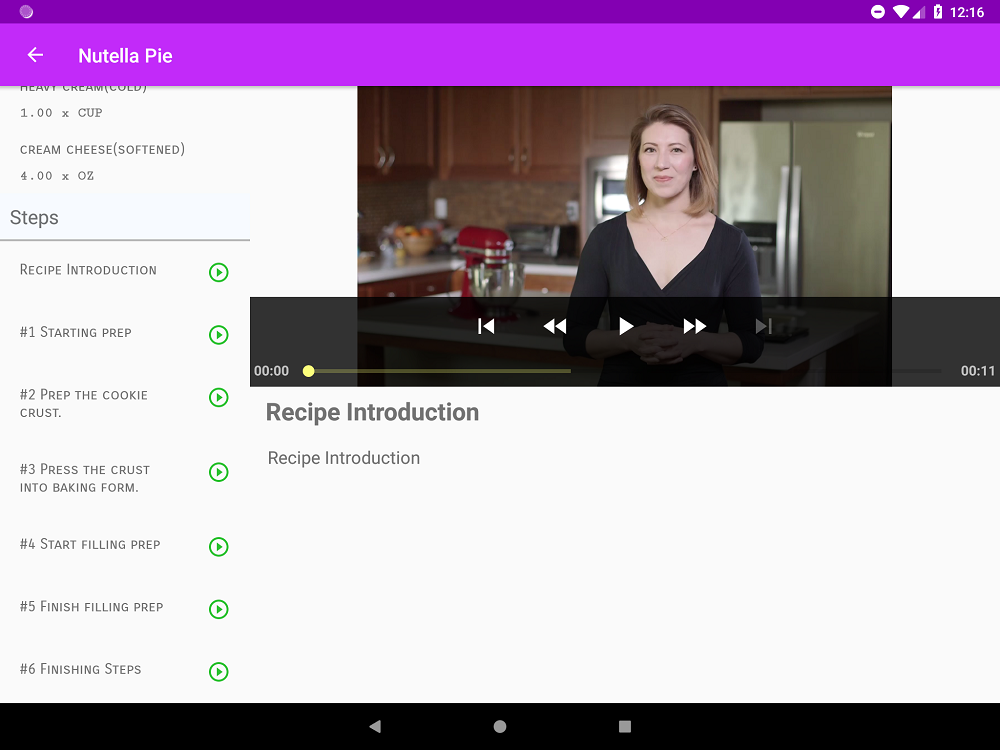
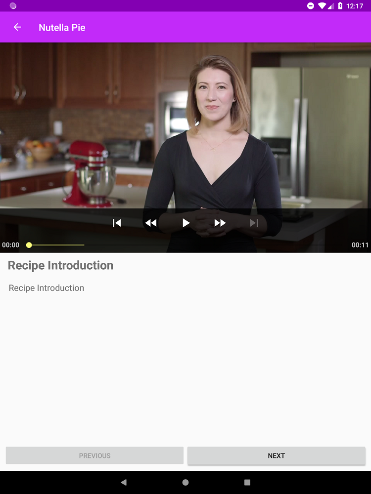
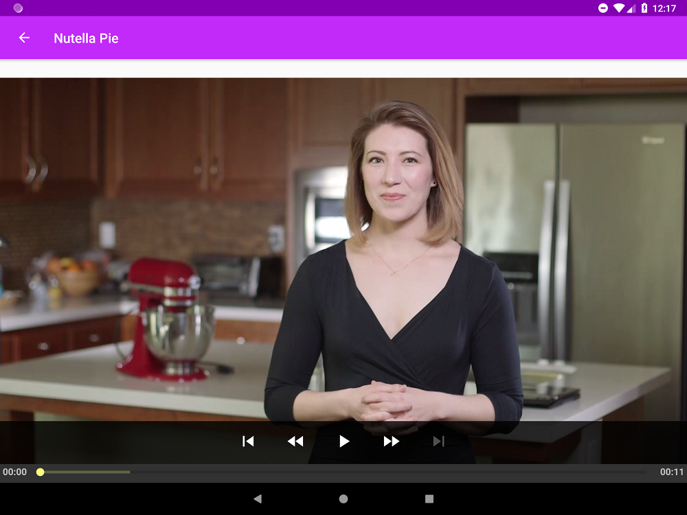
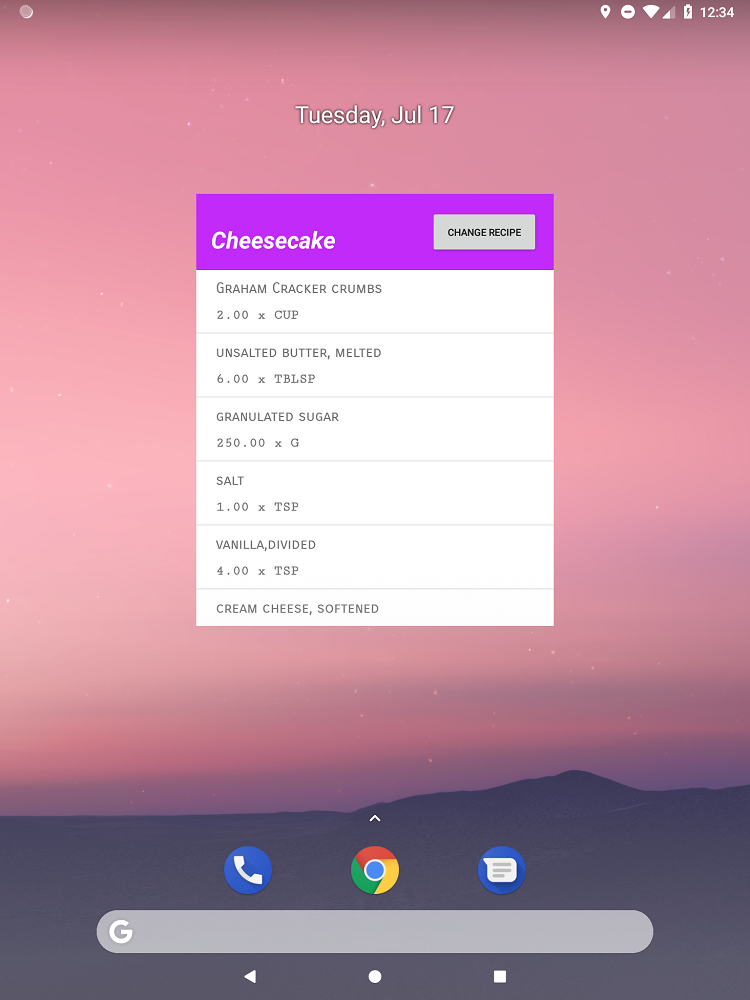

# Baking App

Android application to display a list of recipes from a network resource and allow navigation between recipes and steps to prepare the recipe. It also uses [exoplayer](http://google.github.io/ExoPlayer/) to play videos for some of the recipe's steps.

This is a project made for the [Android Developer Nanodegree from Udacity](https://br.udacity.com/course/android-developer-nanodegree-by-google--nd801).

# Quick start

Clone the repository

````
git clone https://github.com/Artenes/BakingApp
````

And import the project in Android Studio.

# Features

Displays a list of recipes from a network resource



Displays the ingredients and steps for a recipe



In a tablet in ladscape the layout changes to a master-detail layout



Displays the details of a step and allow navigation between them



Shows a video in fullscreen when device is in landscape



Has a widget to display the list of ingredients of a recipe



# Credits

Images used in the application were taken from the following sources:

- Plate of Penne: [https://www.stockvault.net/photo/106936/plate-of-penne](https://www.stockvault.net/photo/106936/plate-of-penne)

# License

MIT License